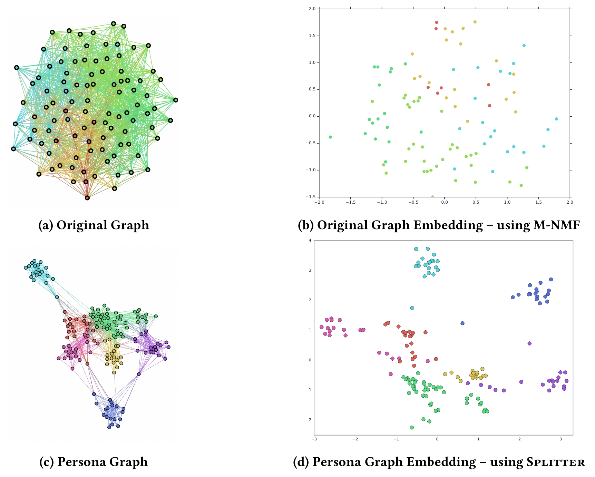
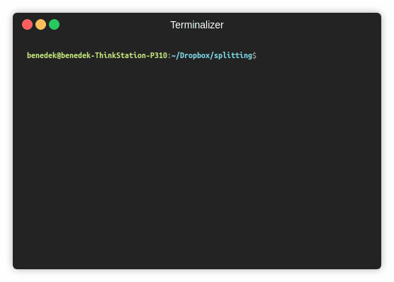

Splitter   
============================================
A PyTorch implementation of "Splitter: Learning Node Representations that Capture Multiple Social Contexts" (WWW 2019).
<p align="center">
  
</p>

### Abstract

<p align="justify">
Recent interest in graph embedding methods has focused on learning a single representation for each node in the graph. But can nodes really be best described by a single vector representation? In this work, we propose a method for learning multiple representations of the nodes in a graph (e.g., the users of a social network). Based on a principled decomposition of the ego-network, each representation encodes the role of the node in a different local community in which the nodes participate. These representations allow for improved reconstruction of the nuanced relationships that occur in the graph a phenomenon that we illustrate through state-of-the-art results on link prediction tasks on a variety of graphs, reducing the error by up to 90%. In addition, we show that these embeddings allow for effective visual analysis of the learned community structure.</p>

This repository provides a PyTorch implementation of Splitter as described in the paper:

> Splitter: Learning Node Representations that Capture Multiple Social Contexts.
> Alessandro Epasto and Bryan Perozzi.
> WWW, 2019.
> [[Paper]](http://epasto.org/papers/www2019splitter.pdf)


The original Tensorflow implementation is available [[here]](https://github.com/google-research/google-research/tree/master/graph_embedding/persona).

### Requirements
The codebase is implemented in Python 3.5.2. package versions used for development are just below.
```
networkx          1.11
tqdm              4.28.1
numpy             1.15.4
pandas            0.23.4
texttable         1.5.0
scipy             1.1.0
argparse          1.1.0
torch             0.4.1
gensim            3.6.0
```
### Datasets
The code takes the **edge list** of the graph in a csv file. Every row indicates an edge between two nodes separated by a comma. The first row is a header. Nodes should be indexed starting with 0. A sample graph for `Cora` is included in the  `input/` directory.

### Outputs

The embeddings are saved in the `input/` directory. Each embedding has a header and a column with the node IDs. Finally, the node embedding is sorted by the node ID column.

### Options
The training of a Splitter embedding is handled by the `src/main.py` script which provides the following command line arguments.

#### Input and output options
```
  --edge-path               STR    Edge list csv.           Default is `input/chameleon_edges.csv`.
  --embedding-output-path   STR    Embedding output csv.    Default is `output/chameleon_embedding.csv`.
  --persona-output-path     STR    Persona mapping JSON.    Default is `output/chameleon_personas.json`.
```
#### Model options
```
  --seed               INT     Random seed.                       Default is 42.
  --number of walks    INT     Number of random walks per node.   Default is 10.
  --window-size        INT     Skip-gram window size.             Default is 5.
  --negative-samples   INT     Number of negative samples.        Default is 5.
  --walk-length        INT     Random walk length.                Default is 40.
  --lambd              FLOAT   Regularization parameter.          Default is 0.1
  --dimensions         INT     Number of embedding dimensions.    Default is 128.
  --workers            INT     Number of cores for pre-training.  Default is 4.   
  --learning-rate      FLOAT   SGD learning rate.                 Default is 0.025
```
### Examples
The following commands learn an embedding and save it with the persona map. Training a model on the default dataset.
```
python src/main.py
```
<p align="center">
  
</p>

Training a Splitter model with 32 dimensions.
```
python src/main.py --dimensions 32
```
Increasing the number of walks and the walk length.
```
python src/main.py --number-of-walks 20 --walk-length 80
```
